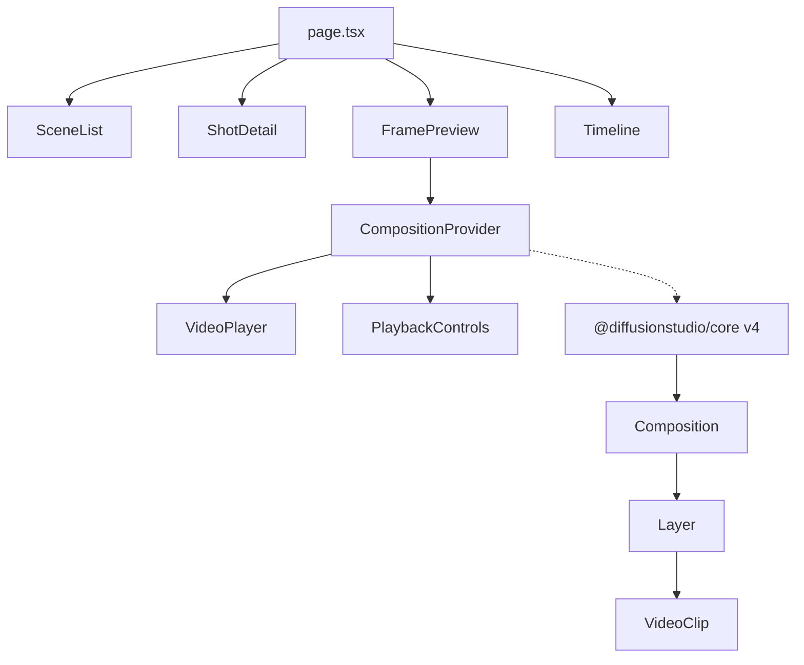
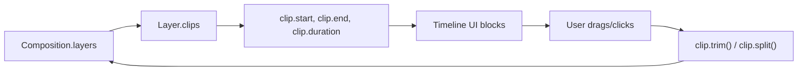

# Timeline Expansion Plan

> Reference document for adding cut, split, trim, and audio controls to the video editor.
> Speed control has been descoped — not planned for implementation.

---

## Current Architecture (~500 LOC, 10 files)



### What exists today

| File | Purpose |
|------|---------|
| `components/editor/CompositionProvider.tsx` | Creates a `Composition` (1920×1080), loads one `VideoClip` per shot, exposes `play()`, `pause()`, `seek()` via React context |
| `components/editor/VideoPlayer.tsx` | Mounts the Composition canvas into a `<div>`, scales it to fit with `ResizeObserver` |
| `components/editor/PlaybackControls.tsx` | Play/pause button, time display (MM:SS), seek slider |
| `components/Timeline.tsx` | Shows shots as simple buttons (fetched from DB), no clip-level representation |
| `components/FramePreview.tsx` | Wraps `CompositionProvider` + `VideoPlayer` + `PlaybackControls` into a preview panel per shot |
| `components/SceneList.tsx` | Scene/shot CRUD sidebar — creates scenes and shots via API |
| `components/ShotDetail.tsx` | Edit shot metadata (title, duration, action, monologue, camera notes) |
| `db/schema.ts` | Drizzle schema — `scenes` and `shots` tables |
| `app/api/scenes/[sceneId]/shots/route.ts` | GET/POST shots for a scene |
| `app/api/shots/[shotId]/route.ts` | GET/PUT/DELETE a single shot |

### What it does NOT do

- No clip manipulation (trim, split, copy)
- No multi-clip awareness (one VideoClip per shot, that's it)
- No visual timeline with clip blocks
- No audio controls (volume, mute, fade)
- No undo/redo

---

## What @diffusionstudio/core v4 Supports Natively

These were confirmed by reading the actual type definitions in `node_modules/@diffusionstudio/core/dist/`.

### Clip base class (`clips/clip/clip.d.ts`)

| Method / Property | Signature | Description |
|-------------------|-----------|-------------|
| `trim()` | `trim(start?: Time, end?: Time): this` | Trims clip to specified in/out points |
| `split()` | `split(time?: Time): Promise<this>` | Splits clip into two at a given time. Returns the newly created clip. Falls back to `composition.currentTime` if no time is passed |
| `copy()` | `copy(): this` | Deep-copies a clip (new ID, shared source) |
| `delay` | `set delay(time: Time)` | Shifts when the clip starts in the composition (offset from zero) |
| `duration` | `set duration(time: Time)` | Sets clip duration (must be positive) |
| `start` | `get/set start: number / Time` | First visible frame. Setting it offsets the clip |
| `end` | `get/set end: number / Time` | Last visible frame. Setting it offsets the clip |
| `disabled` | `disabled: boolean` | Hides a clip without removing it |
| `detach()` | `detach(): this` | Removes clip from its parent layer |
| `transition` | `transition?: TransitionConfig` | Applies transition effects between clips |
| `name` | `get/set name: string` | Human-readable identifier |
| `index` | `get/set index: number` | Position of clip in the layer |
| `animations` | `animations: ClipAnimationOptions` | Keyframe animation properties |

### AudioClip (extended by VideoClip via mixin — `clips/audio/audio.d.ts`)

| Method / Property | Signature | Description |
|-------------------|-----------|-------------|
| `range` | `get range(): [number, number]` / `set range(value: [Time \| undefined, Time \| undefined])` | Defines which portion of the source media to play (in seconds) |
| `volume` | `get/set volume: number` | 0 to 1, defaults to 1 |
| `muted` | `get/set muted: boolean` | Mutes audio |
| `fadeInDurationSeconds` | `get/set fadeInDurationSeconds: number` | Fade-in duration |
| `fadeOutDurationSeconds` | `get/set fadeOutDurationSeconds: number` | Fade-out duration |
| `removeSilences()` | `removeSilences(options?: SilenceRemoveOptions): Promise<AudioClip[]>` | Auto-removes silence gaps |
| `trim()` | `trim(start?: Time, end?: Time): this` | Override with audio awareness |
| `split()` | `split(time?: Time): Promise<this>` | Override with audio awareness |

### VideoClip (`clips/video/video.d.ts`)

Extends `AudioClip` via a visual mixin. Adds spatial properties (position, scale, rotation, opacity, mask, effects, blend mode) but inherits all audio + base clip methods above. No additional time-manipulation methods.

### What is NOT supported natively

| Feature | Status |
|---------|--------|
| ~~Speed / playback rate~~ | ❌ Not supported — **descoped, not pursuing** |
| Undo / Redo | ⚠️ Partial — `createCheckpoint()` / `restoreCheckpoint()` exist but are low-level |
| Timeline UI | ❌ Framework provides no UI at all |

---

## Features to Implement

### 1. Trimming

**Complexity:** 🟢 Low (~50–80 lines)
**Framework support:** ✅ Native `clip.trim(start, end)`

#### How it works

```typescript
// Trim a clip to play only from 2s to 8s of the source
clip.trim(2, 8)

// Alternative: set the range directly
clip.range = [2, 8]
```

#### What to build

- Two drag handles (in-point / out-point) on the timeline or within `PlaybackControls`
- On release, call `clip.trim(inPoint, outPoint)`
- Update composition duration display
- Persist trim values to the database (add `trimStart` / `trimEnd` columns to `shots` table)

#### Files to touch

| File | Change |
|------|--------|
| `CompositionProvider.tsx` | Expose clip reference through context |
| `PlaybackControls.tsx` or new `TrimControls.tsx` | Add trim handle UI |
| `db/schema.ts` | Add `trimStart`, `trimEnd` columns |
| `lib/validators.ts` | Update shot validators |

---

### 2. Splitting

**Complexity:** 🟢 Low (~60–100 lines)
**Framework support:** ✅ Native `clip.split(time)`

#### How it works

```typescript
// Split at the current playhead position
const newClip = await clip.split()

// Or split at a specific time
const newClip = await clip.split(5.0) // split at 5 seconds
```

The framework automatically:
- Creates a new clip from the split point to the original end
- Trims the original clip to end at the split point
- Inserts the new clip into the same layer

#### What to build

- A "Split" button (scissors icon) in the playback controls
- On click: `await clip.split(composition.currentTime)`
- Refresh the timeline UI to show both clips
- Decide how splits map back to the database (create new shot records?)

#### Files to touch

| File | Change |
|------|--------|
| `CompositionProvider.tsx` | Add `splitAtPlayhead()` method to context |
| `PlaybackControls.tsx` | Add split button |
| `Timeline.tsx` | Update to reflect multiple clips |

---

### 3. Multi-Clip Timeline UI

**Complexity:** 🟡 Medium (~200–400 lines) — **this is the biggest piece of work**
**Framework support:** ❌ Build it yourself

#### Why this matters

The current `Timeline.tsx` just renders shot buttons from the database. To visually support trim and split, you need a real timeline where clips are draggable, resizable blocks.

#### What to build

- A horizontal track area where each clip is rendered as a proportionally-sized block
- Playhead cursor that moves with playback (driven by `currentTime`)
- Click-to-select a clip (highlights it, enables trim/split operations)
- Drag handles on clip edges for trimming
- Drag-to-reorder clips within a layer
- Time ruler with tick marks (seconds/frames)
- Zoom in/out to adjust the time scale

#### Data flow



The timeline reads clip positions from the Composition and renders them. User interactions call framework methods, which update the Composition, and the timeline re-renders.

#### Implementation approach

Option A: **Simple custom component** — render `<div>`s absolutely positioned based on `clip.start / composition.duration * trackWidth`. Handle mouse events for drag/resize. ~200-300 lines.

Option B: **Use a library** like `@dnd-kit/core` for drag-and-drop. More polished but adds a dependency.

---

### 4. Volume / Mute / Fade Controls

**Complexity:** 🟢 Low (~40–60 lines)
**Framework support:** ✅ Native

#### How it works

```typescript
clip.volume = 0.5                  // 50% volume
clip.muted = true                  // mute toggle
clip.fadeInDurationSeconds = 1.0   // 1 second fade in
clip.fadeOutDurationSeconds = 0.5  // 0.5 second fade out
```

#### What to build

- Volume slider (0–100%) in `ShotDetail.tsx`
- Mute toggle button
- Fade in/out duration inputs
- Persist values to database (add columns to `shots` table)

---

### 5. Undo / Redo (Future)

**Complexity:** 🔴 High (~200–300 lines)
**Framework support:** ⚠️ Partial

The framework has `createCheckpoint()` and `restoreCheckpoint()` on clips, but a full undo/redo system requires:
- A command stack (command pattern)
- Serializing composition state at each mutating action
- Efficient diffing or snapshot storage

This is a nice-to-have, not needed for MVP.

---

## Aggregate Complexity

| Feature | Lines | Framework | Priority |
|---------|-------|-----------|----------|
| Trim | ~50–80 | ✅ Native | High |
| Split | ~60–100 | ✅ Native | High |
| Multi-clip Timeline UI | ~200–400 | ❌ Custom | High (prerequisite for trim/split UX) |
| Volume / Mute / Fade | ~40–60 | ✅ Native | Medium |
| Undo / Redo | ~200–300 | ⚠️ Partial | Low (future) |

**Total for trim + split + timeline: ~350–600 new lines**, roughly doubling the current ~500 LOC codebase.

> [!NOTE]
> ~80% of the effort is in the timeline UI component. The actual video operations (trim, split) are one-liner API calls. Once the timeline is built, wiring up trim and split is trivial.

---

## Key Architecture Change: Exposing Clips via Context

The single most important refactor is expanding `CompositionProvider` to expose clip-level operations:

```typescript
type CompositionContextValue = {
  // Existing
  composition: core.Composition | null
  isPlaying: boolean
  currentTime: number
  duration: number
  loading: boolean
  play: () => Promise<void>
  pause: () => Promise<void>
  seek: (time: number) => Promise<void>

  // New — clip management
  clips: core.Clip[]
  selectedClip: core.Clip | null
  selectClip: (clip: core.Clip) => void
  splitAtPlayhead: () => Promise<void>
  trimClip: (start: number, end: number) => void
  setVolume: (value: number) => void
  toggleMute: () => void
}
```

This keeps the existing pattern (context provider wraps all diffusionstudio/core interactions) and lets UI components consume clip operations without directly importing the framework.

---

## Database Schema Changes (When Ready)

```sql
-- Add to shots table
ALTER TABLE shots ADD COLUMN trim_start REAL;
ALTER TABLE shots ADD COLUMN trim_end REAL;
ALTER TABLE shots ADD COLUMN volume REAL DEFAULT 1.0;
ALTER TABLE shots ADD COLUMN muted BOOLEAN DEFAULT false;
ALTER TABLE shots ADD COLUMN fade_in REAL DEFAULT 0;
ALTER TABLE shots ADD COLUMN fade_out REAL DEFAULT 0;
```

Or in Drizzle:

```typescript
// db/schema.ts additions to shots table
trimStart: real('trim_start'),
trimEnd: real('trim_end'),
volume: real('volume').default(1.0),
muted: boolean('muted').default(false),
fadeIn: real('fade_in').default(0),
fadeOut: real('fade_out').default(0),
```
